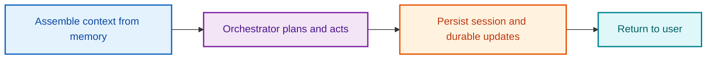
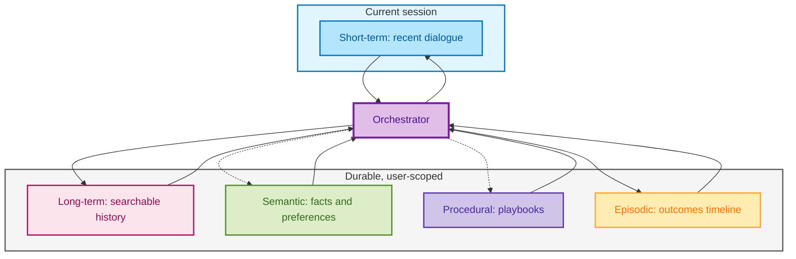
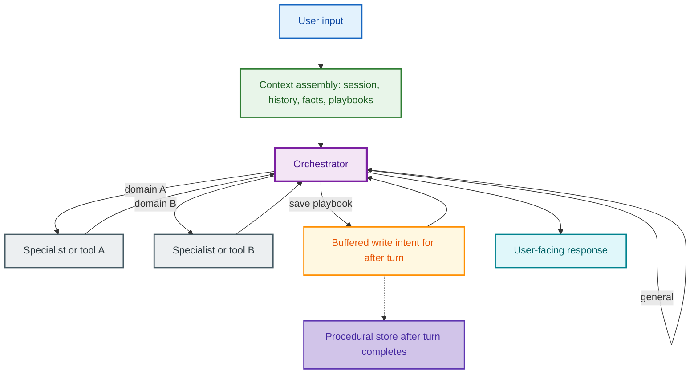
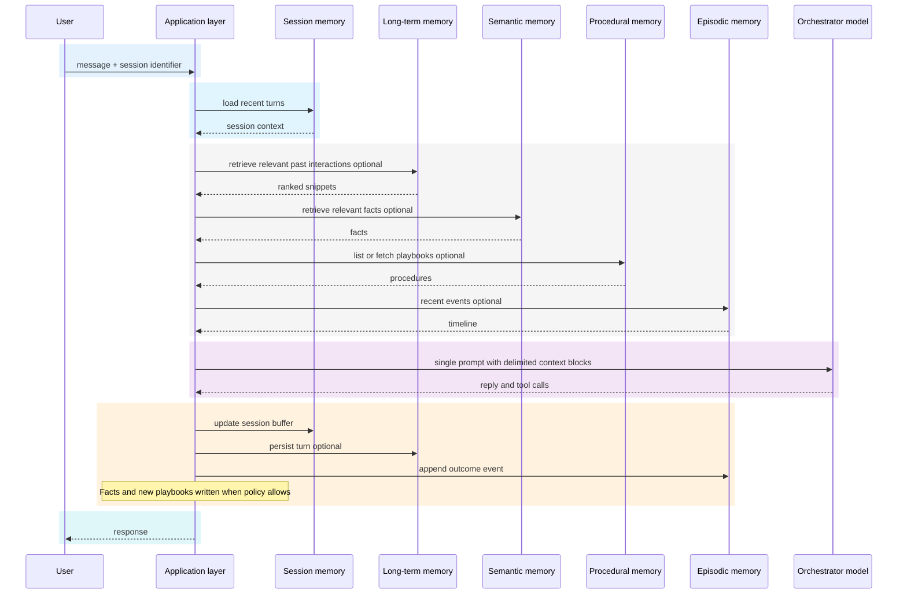
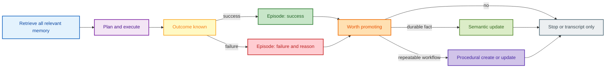
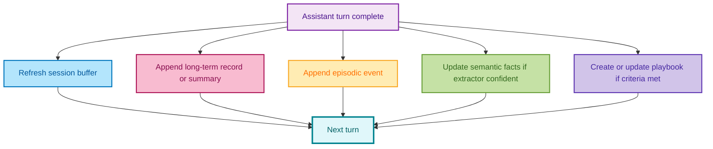
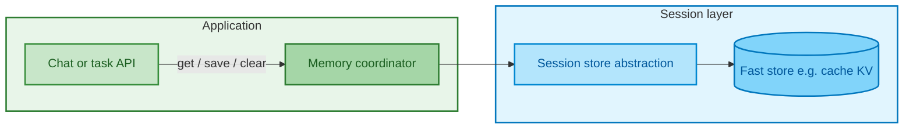
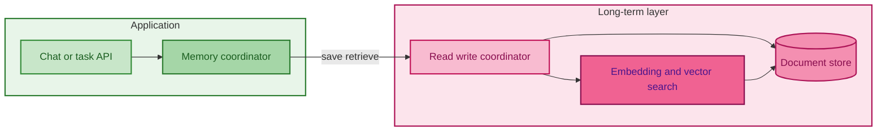
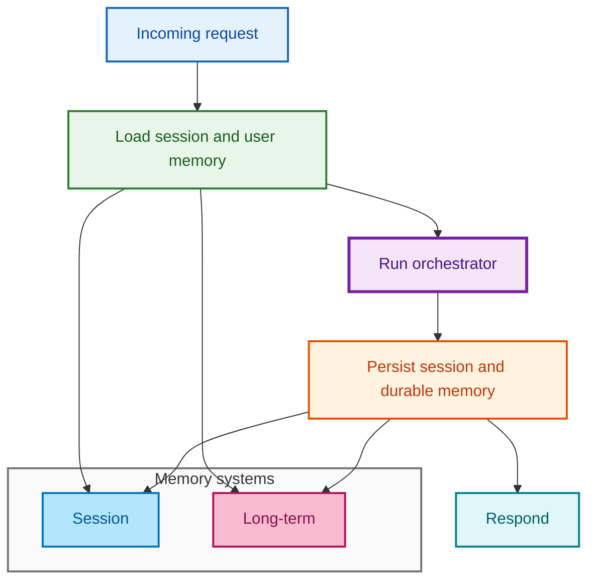
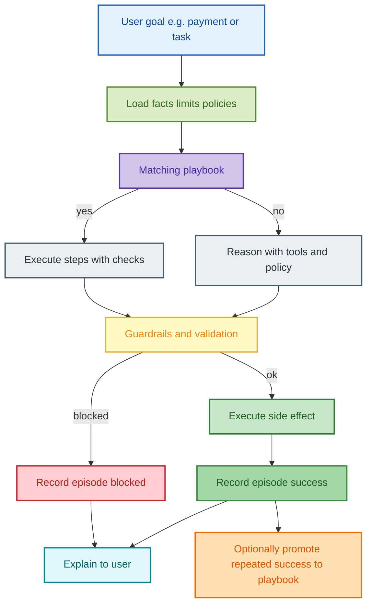

> **Publishing this content in Atlassian Confluence**
>
> * **Page title:** Set the Confluence page title to *End-to-end agentic systems with self-improving behavior* (or your standard naming). Avoid adding a separate Heading 1 in the page body—Confluence uses the page title as the main heading.
> * **Paste / import:** Use your site’s Markdown import or paste (e.g. *Paste markdown* in the floating toolbar, or a Markdown macro) if available. Plain paste from this file may require minor cleanup in the visual editor.
> * **Diagrams (Mermaid):** Confluence does **not** render ` ```mermaid ` code blocks by default. Options: install a **Mermaid** (or diagram) app from Marketplace and use its **macro**—paste **only** the diagram text *inside* the macro, **without** the triple backticks or `mermaid` language tag. Alternatively, recreate diagrams in **draw.io**, **Excalidraw**, or Whimsical and embed images.
> * **Mermaid tips for macros:** Use simple double-quoted labels, avoid special characters in labels where possible, and keep one diagram per macro. Diagrams use **fill and stroke colors** (`style`, `classDef`, and `rect rgb(...)`) for readability; if your Confluence Mermaid app ignores custom styles, diagrams still render as plain boxes.
> * **Checklist:** The rollout section uses a **table** with ☐ so it works when Markdown task lists do not import.

## Overview

**Audience:** architects and engineers designing conversational or task agents that get better over time through memory and feedback—not through on-the-fly model fine-tuning.

**Scope:** a reference pattern for orchestration, multi-layer memory, retrieval, and persistence that you can map to your stack (any LLM framework, cloud, or datastore).


## What we mean by self-improving

In product terms, a **self-improving agent** is one whose **behavior and outputs improve across sessions** because the system **records, retrieves, and reuses** experience. Improvement comes from:

1. **Remembering** user and task context across sessions.
2. **Retrieving** the right context *before* planning or answering.
3. **Logging outcomes** (success, failure, retries, escalations).
4. **Promoting** repeated successes into reusable **playbooks** (procedures).
5. **Updating** durable **facts** and **preferences** when the signal is clear.

Model weights stay fixed; **memory and policy** change. This doc describes how to build that loop reliably.


## Reference architecture at a glance

| Concern | Typical building blocks |
|--------|-------------------------|
| **Session coherence** | Short-term store: last *N* turns, TTL (e.g. cache or key-value) |
| **Cross-session recall** | Long-term store: transcripts or summaries + optional **semantic** search |
| **Stable facts** | Semantic / profile store: facts, preferences, constraints |
| **Playbooks** | Procedural store: named workflows, steps, optional conditions |
| **Learning signal** | Episodic store: time-ordered events and outcomes |
| **Reasoning** | Orchestrator model + optional **specialist** agents or tools |
| **Governance** | What to write, when, and who can read it (PII, retention, audit) |

Technology examples in parentheses are **illustrative only**: Redis for session state, a document database for raw logs, a vector index for similarity search, etc. Swap in what your organization already runs.


## Core design principle: read before act, write after act

For each user turn, a stable pattern is:

1. **Assemble context** from memory (session + user-level stores).
2. **Run** the orchestrator (and tools or sub-agents).
3. **Persist** updates (session buffer, long-term turn, episodes, optional facts and procedures).

If you run the model **before** loading memory, you under-use prior learning. If you **never** persist after the turn, nothing compounds.




## Layered memory: roles and responsibilities

### Short-term (session) memory

**Role:** keep the **current conversation** coherent—references to “earlier in this chat,” pending confirmations, slot filling.

**Characteristics:** scoped to a **session** (or thread), **bounded size**, **TTL**, fast reads/writes.

**Typical operations:** get recent messages for session *S*; append turn; clear session on logout or timeout.


### Long-term (transcript or summary) memory

**Role:** retain **what was said** across sessions so the agent is not starting from zero.

**Characteristics:** durable per **user** (or tenant + user); often a **document** per turn or per session; may include metadata (intent, entities, channel).

**Optional:** attach **embeddings** and a **vector index** so retrieval is by **meaning** (“what did we discuss about budgets?”) not only keywords.


### Semantic memory (facts and preferences)

**Role:** store **concise, stable** statements: preferences, profile facts, domain rules the product should consistently honor.

**Characteristics:** usually **user-scoped**; **searchable** (vector or structured); **updated** when the user corrects you or when policy changes.

**Typical operations:** add or upsert fact; search facts given current query; list or prune stale facts.


### Procedural memory (playbooks)

**Role:** store **how** to do recurring tasks: ordered steps, checklists, escalation paths.

**Characteristics:** **named** procedures; optional **conditions** (“when ticket is P1”); versioned or timestamped if governance matters.

**Typical operations:** save procedure; list procedures for user; fetch by name; inject into prompt when relevant.


### Episodic memory (what happened)

**Role:** **event log** for analytics and learning: tool failures, retries, human handoffs, successful resolutions.

**Characteristics:** **append-mostly**; rich **metadata** (latency, error code, SKU, region); filterable by time and event type.

**Use:** drive dashboards, trigger “promote to procedure,” and detect regressions after releases.


## How the layers fit together (conceptual)



Solid arrows: common every-turn read/write paths. Dotted arrows: **promotional** or **conditional** writes (not every message should become a fact or a new procedure).


## Orchestration: one front door, optional specialists

A practical pattern for complex products:

* A single **orchestrator** faces the user (classification, safety, tone, delegation).
* **Specialist** agents or **tools** handle domains (billing, inventory, HR policy) with **structured outputs** where possible.
* Sub-agents **do not** bypass the orchestrator to the user unless your product explicitly allows it.

**Routing:** define **intents** (or a small policy model) and **delegation rules**. Keep specialist prompts narrow; keep orchestrator instructions explicit about when to delegate and when to answer from **injected context** (e.g. “saved playbooks” section in the prompt).




## One turn, end to end (sequence)




## Self-improvement loop (behavioral)




## Writes after the turn: what usually happens



Not every product needs all five every time; define **triggers** (e.g. only promote procedures after *k* similar successes).


## Short-term memory: component view




## Long-term memory with optional semantic retrieval

Many teams store **raw documents** in a database and **search embeddings** in a vector index (same or separate system).



**Save path (conceptual):** normalize text → embed → write document and vector pointer → index for search.

**Retrieve path:** embed query → similarity search → return top-*k* with scores → optional score threshold.

**Design choice:** some libraries can call an LLM during ingest to **infer** atomic memories. That is powerful but adds cost, latency, and failure modes. Many production systems instead use **explicit extraction** (your own prompt or rules) into semantic and procedural stores.


## Combined flow: load memory, run orchestrator, save




## Retrieval order before generation (recommended default)

1. **Session** context (immediate thread).
2. **Semantic** facts and hard constraints (policies, preferences).
3. **Procedural** playbooks if the task type matches.
4. **Long-term** history by semantic or hybrid search.
5. **Episodic** signals if you optimize for risk avoidance or repeat-incident handling.

Then **compose** one structured prompt (clear delimiters, cite source of each block). Avoid dumping unbounded text; **cap tokens** per block and total.


## Domain examples (how layers apply)

### Transaction or payments agent

* **Session:** amounts, recipients, pending MFA.
* **Long-term:** prior disputes and resolutions.
* **Episodic:** declines, limits, fraud flags, reference IDs.
* **Semantic:** default funding source, jurisdiction rules.
* **Procedural:** “verify high-value transfer” checklist.

**Improvement:** repeated failure reasons become **precheck steps** in the playbook; user corrections update **semantic** defaults.

### Support or triage agent

* **Semantic:** entitlements, known outages.
* **Procedural:** runbooks by symptom.
* **Episodic:** resolution paths that worked.
* **Long-term:** full ticket-style history when allowed.

**Improvement:** successful paths become **named runbooks**; noisy escalations become **routing rules**.

### Personal productivity agent

* **Semantic:** hours, style, goals.
* **Long-term:** commitments mentioned earlier.
* **Episodic:** follow-through over time.
* **Procedural:** weekly review, morning plan.

**Improvement:** if long plans are ignored, shorten default plan **procedure** or update **preference** facts.




## Data hygiene and safety

**Prefer storing**

* Durable preferences and policy facts.
* Summaries and structured outcomes, not full sensitive payloads unless required.
* Playbooks with explicit **when-to-use** conditions.

**Avoid**

* Duplicating the same narrative in four stores without purpose.
* Secrets in prompts or memory without vaulting and access control.
* Low-confidence extractions as immutable facts.

**Mnemonic**

* **Episodic** — what happened.
* **Semantic** — what is true (for the product).
* **Procedural** — how we do it.


## Governance and operations

* **Retention:** TTL for session; archival policy for long-term and episodes.
* **PII and consent:** what is stored, where, and for how long.
* **Quality:** periodic review of retrieved chunks and promoted playbooks.
* **Versioning:** when a procedure changes, keep **effective date** or version for audit.
* **Streaming APIs:** if you stream tokens to the client, ensure **the same context assembly** runs as in your non-streaming path unless you deliberately scope a lighter path.


## Metrics that indicate real improvement

* Task **success rate** and **time to resolution**.
* **Retries**, **tool errors**, and **user corrections** trending down.
* **Playbook reuse** and **semantic hit** quality (sampled review).
* **Escalation** rate for recurring issue classes.


## Rollout checklist (for your program)

Use Confluence task checkboxes on each row if your editor supports them; otherwise copy the ☐ column into a manual checklist.

| Step | Action | Done |
|------|--------|------|
| 1 | Define **memory tiers** and **owners** (who may read/write each). | ☐ |
| 2 | Implement **read path** (context assembly) with **budgets** per block. | ☐ |
| 3 | Implement **write path** after each turn (minimum: session + long-term or summary). | ☐ |
| 4 | Add **episodes** for measurable outcomes. | ☐ |
| 5 | Define **promotion rules** for facts and playbooks (thresholds, human review optional). | ☐ |
| 6 | Add **observability** (latency per store, cache hit rate, retrieval scores). | ☐ |
| 7 | Run **red-team / privacy** review on stored content. | ☐ |
| 8 | Document **orchestrator routing** and **specialist** boundaries for your team wiki. | ☐ |


## Summary

An end-to-end **self-improving agentic system** combines **orchestration**, **tools or specialists**, and **layered memory** with a strict **retrieve → act → persist** rhythm. Session memory keeps the thread coherent; long-term and semantic layers personalize and ground answers; episodic and procedural layers close the loop so **behavior improves with use**. Map the patterns above to your frameworks and data stores; the architecture stays the same even when the vendors change.

**Suggested Confluence page title:** *End-to-end agentic systems with self-improving behavior*
