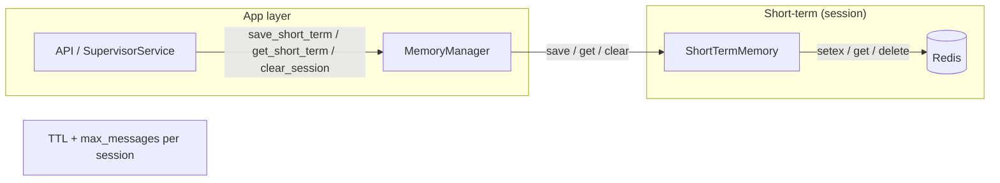
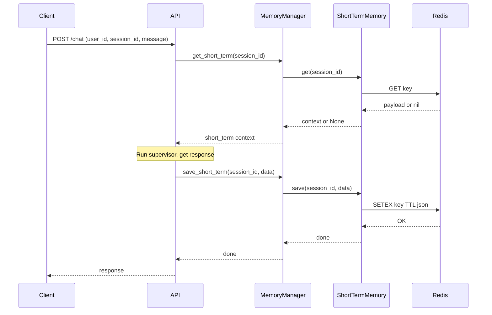
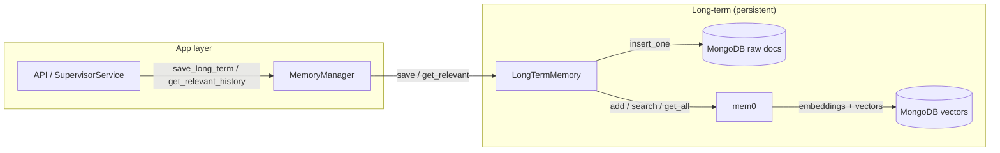
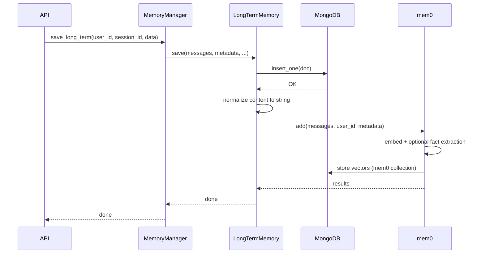
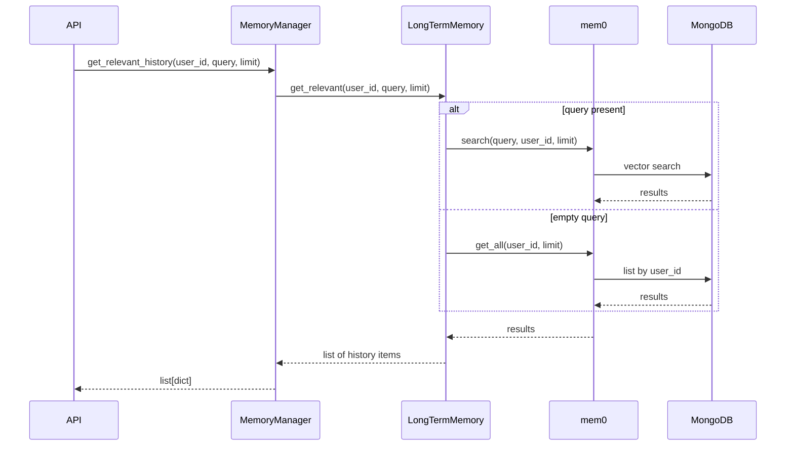
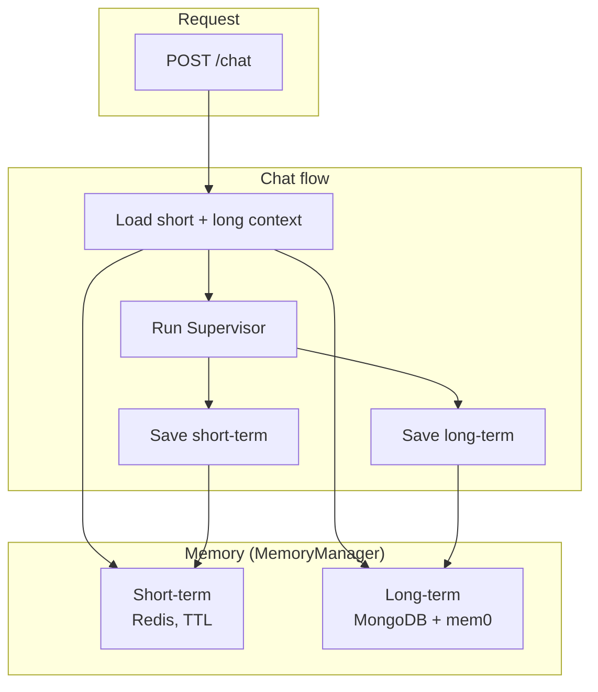

# Memory architecture: short-term and long-term

This document describes how short-term (Redis) and long-term (MongoDB + mem0) memory work and how they are used in the chat flow.

---

## Short-term memory (Redis)

Session-scoped buffer: last N messages, TTL. Implemented by `ShortTermMemory` in `app.memory.short_term`.

### Component flow

### Sequence (one chat turn)

---

## Long-term memory (MongoDB + mem0)

Persistent, searchable by user. Raw docs in MongoDB; semantic search via mem0 (vectors in MongoDB). Implemented by `LongTermMemory` in `app.memory.long_term`.

### Component flow

### Sequence: save (after each turn)

### Sequence: retrieve (relevant history)

---

## Combined chat flow

---

## MongoDB collection names (long-term)

| Purpose        | Env / default           | Where to look in MongoDB        |
|----------------|-------------------------|----------------------------------|
| Raw documents  | `MONGODB_COLLECTION` → `agent_long_memory`  | DB: `MONGODB_DB` (e.g. `agent_memory`) |
| mem0 vectors   | `MEM0_COLLECTION` → `mem0_long_memory`     | Same DB; created on first mem0 write. Requires Atlas Search. |

If the mem0 collection is missing, see [Long-term memory README](../app/memory/long_term/README.md#if-you-dont-see-the-mem0-collection-in-mongodb).

---

## Related docs

- [Short-term memory (Redis)](../app/memory/short_term/README.md) — usage and config for `ShortTermMemory`.
- [Long-term memory (MongoDB + mem0)](../app/memory/long_term/README.md) — usage and config for `LongTermMemory`.
